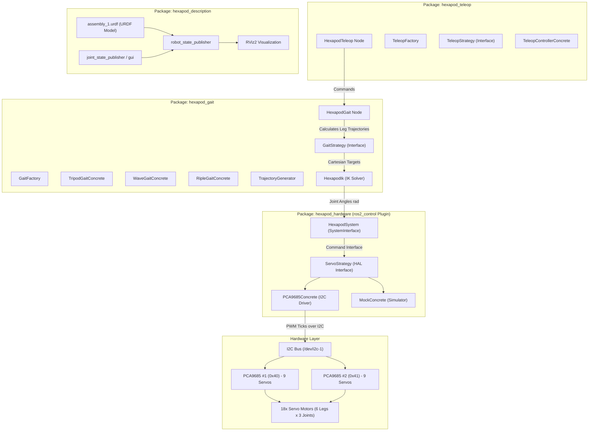
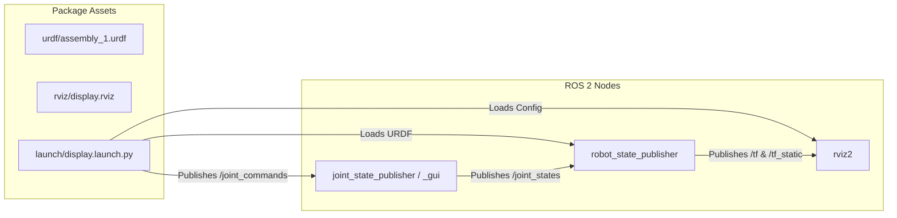
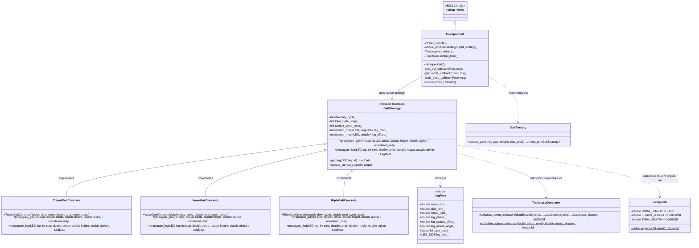
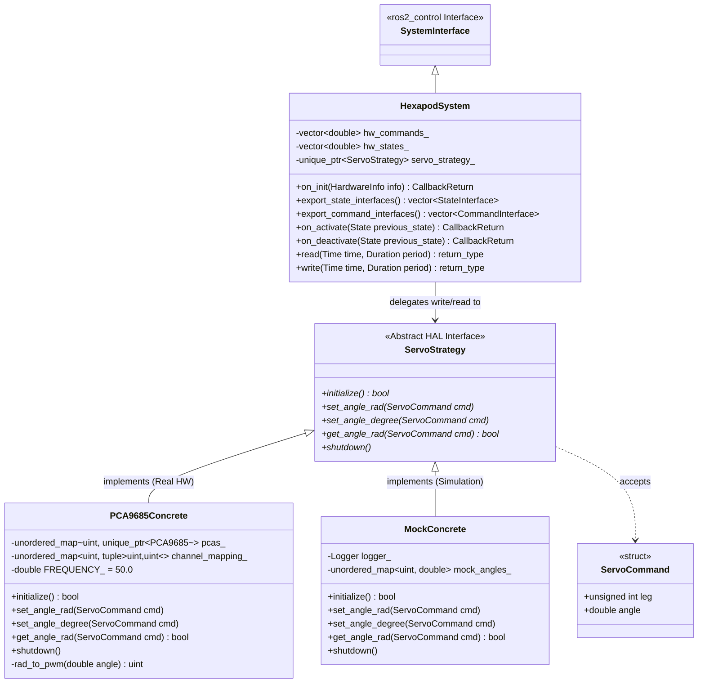
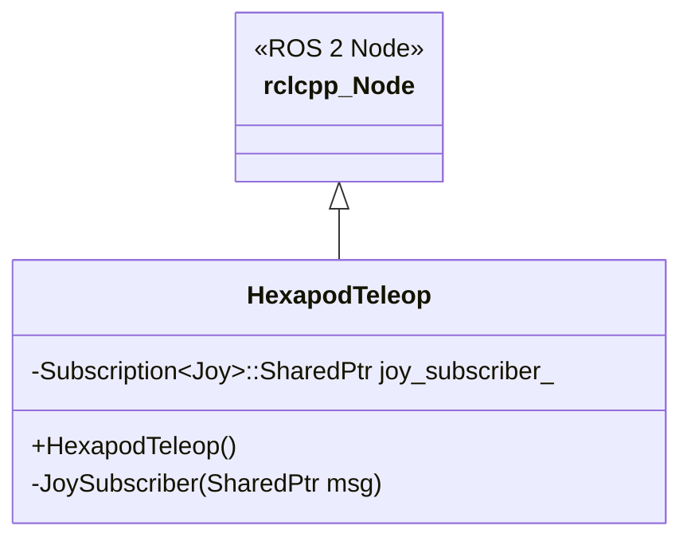
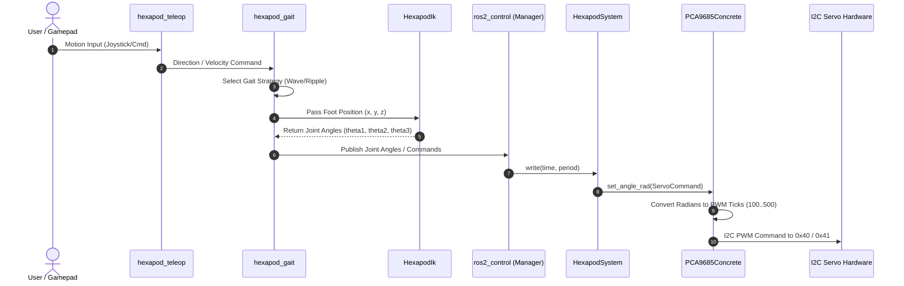

# Jeff Hexapod System Architecture

This document provides a detailed architectural breakdown of the **Jeff Hexapod** codebase, structured per package.

---

## 1. High-Level System Architecture

The project consists of four ROS 2 packages organized following modular design principles (Strategy Pattern, Factory Pattern, Hardware Abstraction Layer, and `ros2_control` integration).

---

## 2. Package Breakdowns & Internal Architecture

### 2.1 [`hexapod_description`](../src/hexapod_description)

#### Overview
Defines the physical and kinematic model of the hexapod robot using Unified Robot Description Format (URDF) and provides launch configurations for state publishing and RViz visualization.

#### Architectural Diagram

#### Key Components:
- **URDF Model (`urdf/assembly_1.urdf`)**: Describes 18 revolute joints across 6 legs (`LF`, `LM`, `LR`, `RF`, `RM`, `RR`) with three segments per leg: `coxa`, `femur`, and `tibia`.
- **Display Launch (`launch/display.launch.py`)**: Configures `robot_state_publisher` and `joint_state_publisher_gui` to visualize joint states in `rviz2`.

---

### 2.2 [`hexapod_gait`](../src/hexapod_gait)

#### Overview
Responsible for gait generation, step sequencing, and analytical inverse kinematics (IK) calculation for all 6 legs.

#### Class Diagram & Architecture

#### Key Design Patterns & Modules:
- **Strategy Pattern**: `GaitStrategy` defines the abstract interface for leg gait propagation. `TripodGaitConcrete` (Duty Cycle: 0.5), `WaveGaitConcrete` (Duty Cycle: 0.833), and `RipleGaitConcrete` (Duty Cycle: 0.667) implement specific leg phase offset configurations and timing profiles.
- **Factory Pattern**: `GaitFactory::create_gait()` instantiates requested strategies dynamically by string name (`"tripod_gait"`, `"wave_gait"`, `"ripple_gait"` / `"riple_gait"`).
- **Trajectory Generator (`TrajectoryGenerator`)**: Computes 3D parabolic swing trajectories ($z = -H \sin(\phi)$) and linear stance ground return trajectories for leg propagation.
- **Analytical IK Solver (`HexapodIk`)**: Solves 3-DOF inverse kinematics for each leg given target Cartesian coordinates $(x, y, z)$:
  $$\theta_1 = \text{atan2}(y, x)$$
  $$\theta_2 = \alpha + \beta$$
  $$\theta_3 = \text{acos}\left(\frac{L_F^2 + L_T^2 - c^2}{2 L_F L_T}\right) - \pi$$
- **Doxygen API Documentation**: Every header and source file in `hexapod_gait` is fully documented in standard Doxygen format (`/** ... */`) covering file headers, classes, methods, parameters, return values, macros, structs, and enums.

---

### 2.3 [`hexapod_hardware`](../src/hexapod_hardware)

#### Overview
Integrates physical servo drivers with the `ros2_control` framework using a custom `hardware_interface::SystemInterface` plugin.

#### Class Diagram & Architecture

#### Key Features:
- **`ros2_control` Plugin**: Exported via `PLUGINLIB_EXPORT_CLASS(hexapod_hardware::HexapodSystem, hardware_interface::SystemInterface)` and declared in `hexapod_hardware.xml`.
- **PCA9685 I2C Mapping**: Drives 18 servos across two PCA9685 I2C boards at `0x40` (channels 0..8) and `0x41` (channels 9..17) at 50 Hz PWM frequency.
- **Hardware Abstraction Layer (HAL)**: `ServoStrategy` enables seamless switching between physical PCA9685 execution (`PCA9685Concrete`) and dry-run mock testing (`MockConcrete`).

---

### 2.4 [`hexapod_teleop`](../src/hexapod_teleop)

#### Overview
Provides the teleoperation interface for receiving remote control commands and delegating motion directives to the gait system.

#### Class Diagram & Architecture

---

## 3. Data Flow Sequence

The end-to-end execution loop for joint movement follows the sequence below:

